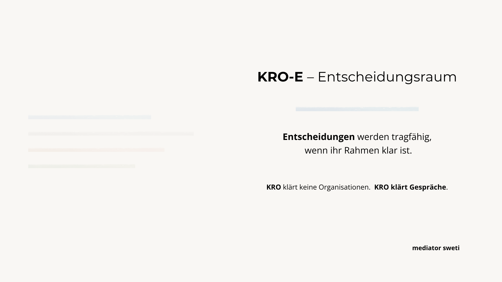
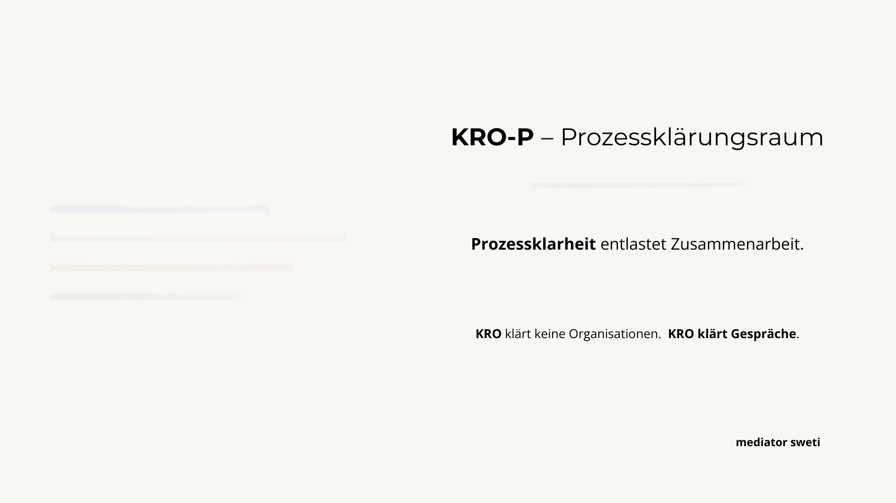
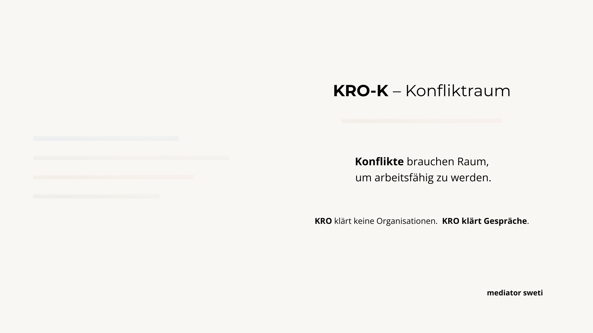
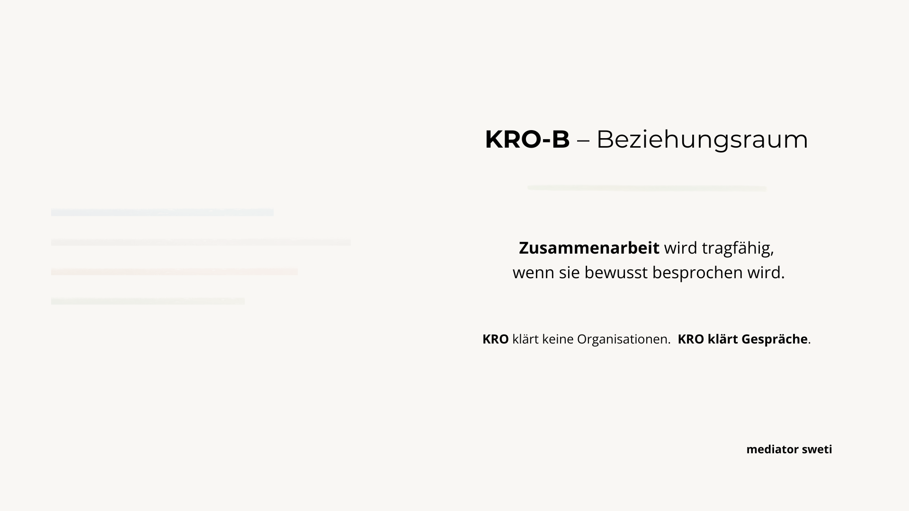

Viele Gespräche in Organisationen scheitern nicht an den Menschen.
Sondern am Rahmen.

In Meetings, Workshops oder Abstimmungen werden häufig unterschiedliche Anliegen
gleichzeitig verhandelt: Entscheidungen, Prozesse, Beziehungen und Konflikte.

Das überfordert Gespräche.
Orientierung geht verloren.
Klärung wird unwahrscheinlich.

Das Format **Klärungsräume Organisation (KRO)** setzt genau hier an.

---

## Ein Gespräch. Ein Anlass. Ein klarer Rahmen.

KRO unterstützt Organisationen dabei, für unterschiedliche Kommunikationsanlässe
den jeweils passenden Gesprächsrahmen zu wählen
und diesen professionell zu moderieren.

Nicht Inhalte werden gesteuert,
sondern die Bedingungen,
unter denen Klärung möglich wird.

Pro Termin wird **ein** Gesprächsrahmen gewählt.
Andere Themen bleiben sichtbar,
werden aber bewusst **nicht vermischt**.

**KRO klärt keine Organisationen.
KRO klärt Gespräche.**

---

## Die vier Klärungsräume

KRO unterscheidet vier zentrale Gesprächsrahmen,
die sich in Organisationen immer wieder zeigen.

### Entscheidungsraum (KRO-E)

**Entscheidungen werden tragfähig,
wenn ihr Rahmen klar ist.**

Der Entscheidungsraum wird genutzt,
wenn Entscheidungen vorbereitet oder getroffen werden sollen.

Im Fokus stehen:
- Entscheidungslogik
- Zuständigkeiten
- Optionen und Folgen

Nicht Teil dieses Raums sind:
Prozessdetails, Beziehungsthemen oder Konfliktbearbeitung.

Die Moderation hält den Rahmen
und trifft selbst keine Entscheidungen.

---

### Prozessklärungsraum (KRO-P)

**Prozessklarheit entlastet Zusammenarbeit.**

Der Prozessklärungsraum dient der Klärung von Abläufen,
Zuständigkeiten und Schnittstellen.

Im Fokus stehen:
- Wer macht was?
- Wann und wie erfolgen Übergaben?
- Wo entstehen Reibungen?

Nicht Teil dieses Raums sind:
Leistungsbewertungen, persönliche Konflikte oder Grundsatzentscheidungen.

Die Moderation strukturiert die Klärung,
ersetzt jedoch keine Fachverantwortung.

---

### Konfliktraum (KRO-K)

**Konflikte brauchen Raum,
um arbeitsfähig zu werden.**

Der Konfliktraum wird genutzt,
wenn Spannungen eskalieren oder Gespräche blockieren.

Im Fokus stehen:
- Unterbrechung von Eskalation
- Sichtbarmachen unterschiedlicher Perspektiven
- Wiederherstellung von Gesprächsfähigkeit

Nicht Ziel dieses Raums sind:
Schuldzuweisungen, Sanktionen oder schnelle Lösungen.

Die Moderation schützt den Rahmen,
ergreift keine Partei
und erzwingt keine Einigung.

---

### Beziehungsraum (KRO-B)

**Zusammenarbeit wird tragfähig,
wenn sie bewusst besprochen wird.**

Der Beziehungsraum dient der Reflexion von Zusammenarbeit,
insbesondere nach Veränderungen oder in Phasen erhöhter Belastung.

Im Fokus stehen:
- Erwartungen
- Rollenverständnisse
- gemeinsame Arbeitsweisen

Nicht Teil dieses Raums sind:
Entscheidungen, Prozessfragen oder Konfliktbearbeitung.

Die Moderation strukturiert den Austausch,
ohne Ergebnisse vorzugeben.

---

## Rolle der Moderation

Die Moderation im KRO-Format:

- setzt und hält den Gesprächsrahmen
- steuert den Prozess, nicht die Inhalte
- macht Themenwechsel sichtbar
- sorgt für Anschlussfähigkeit

Die Moderation:

- trifft keine Entscheidungen
- übernimmt keine Verantwortung für Ergebnisse
- ersetzt keine Führung
- löst keine Konflikte stellvertretend

**Die Moderation hält den Rahmen –
das System entscheidet selbst.**

---

## Einstieg und Auftragsklärung

Der Einstieg in KRO erfolgt über ein kurzes Vorgespräch.

Dabei werden geklärt:
- der Anlass (Beobachtungen, nicht Ursachen)
- der passende Klärungsraum (E / P / K / B)
- der Teilnehmerkreis
- der Auftrag als Gesprächsfunktion
- Rahmenbedingungen und Rolle der Moderation

**Ein guter Einstieg entscheidet darüber,
ob Klärung möglich wird.**

---

## Passt KRO zu Ihrem Anlass?

KRO ist kein Problemlösungsformat,
kein Workshop
und keine Mediation im engeren Sinn.

Es eignet sich,
wenn Gespräche arbeitsfähig geführt werden sollen,
ohne Anliegen zu vermischen oder zu überfrachten.

Ein kurzes Vorgespräch genügt,
um zu prüfen, ob KRO für Ihren Anlass passt.

---

## Einordnung im Angebotsgefüge

KRO ist ein methodisches Werkzeug, das in zwei Kontexten zum Einsatz kommt:

- **Als eigenständiges Moderationsformat** für klar abgegrenzte Gesprächsanlässe
- **Als Bestandteil einer [Konfliktberatung](/services/konfliktberatung-verwaltung-sachsen/)** für komplexere Konfliktlagen, in denen mehrere Klärungsräume nacheinander oder parallel benötigt werden

Wenn aus einer organisationalen Klärung konkrete Spannungen oder Konflikte zwischen einzelnen Beteiligten sichtbar werden, kann eine [Mediation](/services/mediation-verwaltung-sachsen/) anschlussfähig sein. In technisch geprägten Organisationen mit Spannungen an Schnittstellen kann eine [Mediation im IT-Umfeld](/services/mediation-it-umfeld/) eine geeignete Vertiefung sein.

---

## Nächster Schritt

Wenn Sie klären möchten, ob und wie ich Sie unterstützen kann:
Schreiben Sie mir kurz Ihr Anliegen – oder buchen Sie ein kostenfreies Orientierungsgespräch.

 → Sie können einen Orientierungsrahmen kostenlos [hier](https://mediator.sweti.de/leadmagnets/klaerungsraum-orientierung/) herunterladen

 [**Terminbuchung auf Calendly**](https://calendly.com/mediator-sweti)   
 **E-Mail:** [mediator@sweti.de](mailto:mediator@sweti.de)   

---
## Interne Links

- [**Profil & Hintergrund**]()
- [**Arbeitsweise**]()
- [**Haltung**]()
- [**Angebote & Formate**]()
- [**Kontakt**]()